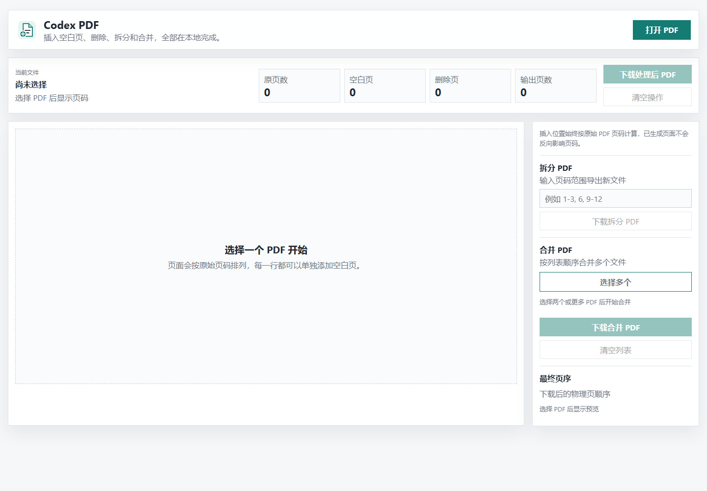
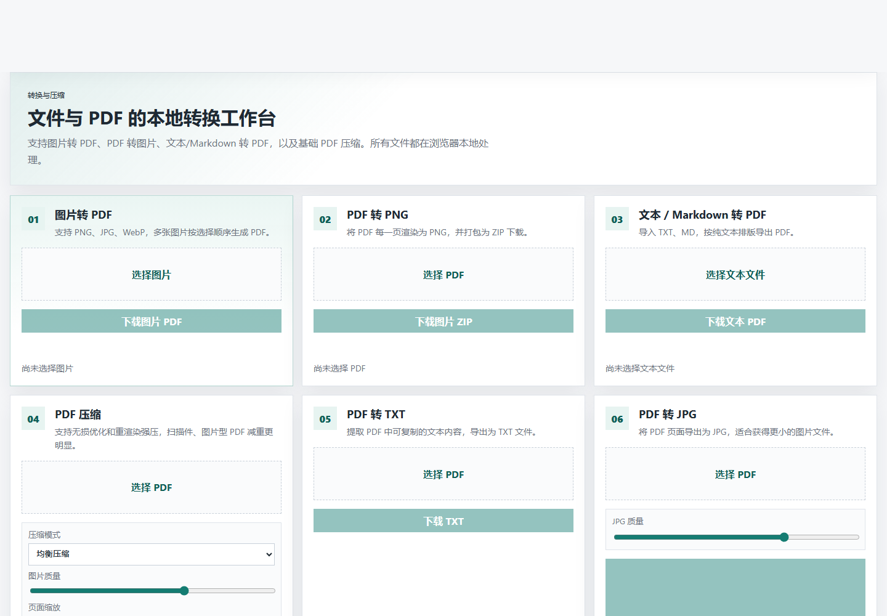

# MoaPDF

MoaPDF 是一个本地运行的网页 PDF 工作台，面向打印前整理、扫描件处理、多文件汇总和常见格式转换。它支持在浏览器中预览 PDF 页面缩略图，并完成插入空白页、删除页面、拆分 PDF、合并 PDF、图片转 PDF、PDF 转图片、文本转 PDF、PDF 压缩等操作。

所有 PDF 处理都在浏览器本地完成，文件不会上传到服务器。

## 页面预览

### 页面整理



### 格式转换



## 功能特点

- 可视化预览 PDF 页面缩略图。
- 支持在首页前、任意原始页后插入一张或多张空白页。
- 支持删除指定页面。
- 支持按页码范围拆分 PDF。
- 支持选择多个 PDF 并按指定顺序合并。
- 支持图片转 PDF。
- 支持 PDF 转 PNG 图片 ZIP。
- 支持 PDF 转 JPG 图片 ZIP，并可调节 JPG 质量。
- 支持 PDF 转 TXT。
- 支持 TXT / Markdown 转 PDF。
- 支持 PDF 无损优化、均衡压缩、强力压缩和极限压缩。
- 提供最终页序预览，方便确认下载后的页面顺序。
- 插入位置按原始 PDF 页码计算，不会因为前面插入了空白页而错位。
- 空白页尺寸会参考相邻原始页面尺寸。

## 使用方式

安装依赖：

```powershell
npm install
```

启动项目：

```powershell
npm run dev
```

打开本地地址：

```text
http://127.0.0.1:5173
```

## 插入空白页

1. 点击 `打开 PDF`。
2. 查看页面缩略图，找到需要插入空白页的位置。
3. 在 `首页前` 或 `第 N 页后` 的卡片右侧点击 `+`。
4. 查看 `最终页序`。
5. 点击 `下载处理后 PDF`。

## 删除页面

1. 点击 `打开 PDF`。
2. 在页面缩略图卡片上点击 `删除页面`。
3. 点击 `下载处理后 PDF`。

## 拆分 PDF

1. 点击 `打开 PDF`。
2. 在 `拆分 PDF` 中输入页码范围，例如：

```text
1-3, 6, 9-12
```

3. 点击 `下载拆分 PDF`。

## 合并 PDF

1. 在 `合并 PDF` 区域点击 `选择多个`。
2. 通过 `上移`、`下移`、`移除` 调整文件顺序。
3. 点击 `下载合并 PDF`。

## 转换与压缩

点击顶部 `格式转换` 进入独立工具页。

当前支持：

- 图片转 PDF：选择 PNG、JPG、WebP 图片，生成 PDF。
- PDF 转图片：将 PDF 每页渲染为 PNG，并打包为 ZIP。
- PDF 转 JPG：将 PDF 每页渲染为 JPG，并打包为 ZIP。
- PDF 转 TXT：提取 PDF 中可复制的文本内容。
- 文本 / Markdown 转 PDF：选择 TXT 或 MD 文件，导出 PDF。
- PDF 压缩：支持无损优化和重渲染强压，自动选择更小的结果；可调节图片质量、页面缩放，并支持灰度压缩。

## 技术栈

- Vite
- PDF.js / `pdfjs-dist`
- `pdf-lib`
- `jszip`

## 适用场景

- 打印双面 PDF 时补空白页。
- 保持原 PDF 页码不变，只改变纸张分页。
- 删除扫描件中的空白页或错误页。
- 从长 PDF 中导出指定章节或页码范围。
- 将多个 PDF 汇总成一个文件。
- 将图片、文本文件转换为 PDF。
- 将 PDF 页面导出为图片。
